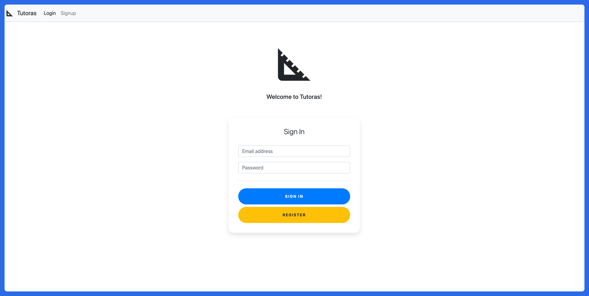

# Tutoras

`Tutoras` is a mock web application for connecting students and tutors with an integrated payment service. It's built using Spring Boot, Angular and MySQL. This project can be used as an example of how to set up Spring Security with Angular.

  

## Requierments

* JDK 8
* [NodeJS](https://nodejs.org/en/download/)
* [MySQL](https://www.mysql.com/)

## Setup Tutoras

* Download and install MySQL
* Setup the database
	* `CREATE DATABASE tuoras_db`
	* Setup application.properties
		* `spring.datasource.username=`
		* `spring.datasource.password=`
* Get your [Stripe API Key](https://stripe.com/docs/keys)
	* Set your `STRIPE_PUBLIC_KEY` and `STRIPE_SECRET_KEY` in `application.properties` and in `index.html` at `const stripe = Stripe(YOUR_KEY)`

## Starting Tutoras

The entry point is `TutorasApplication` for the back end server